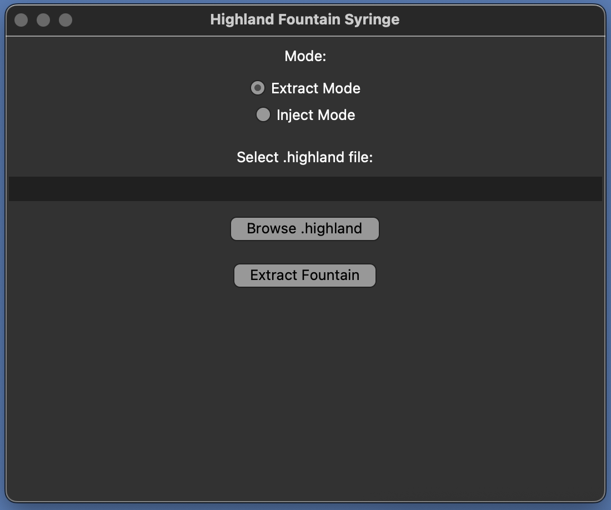
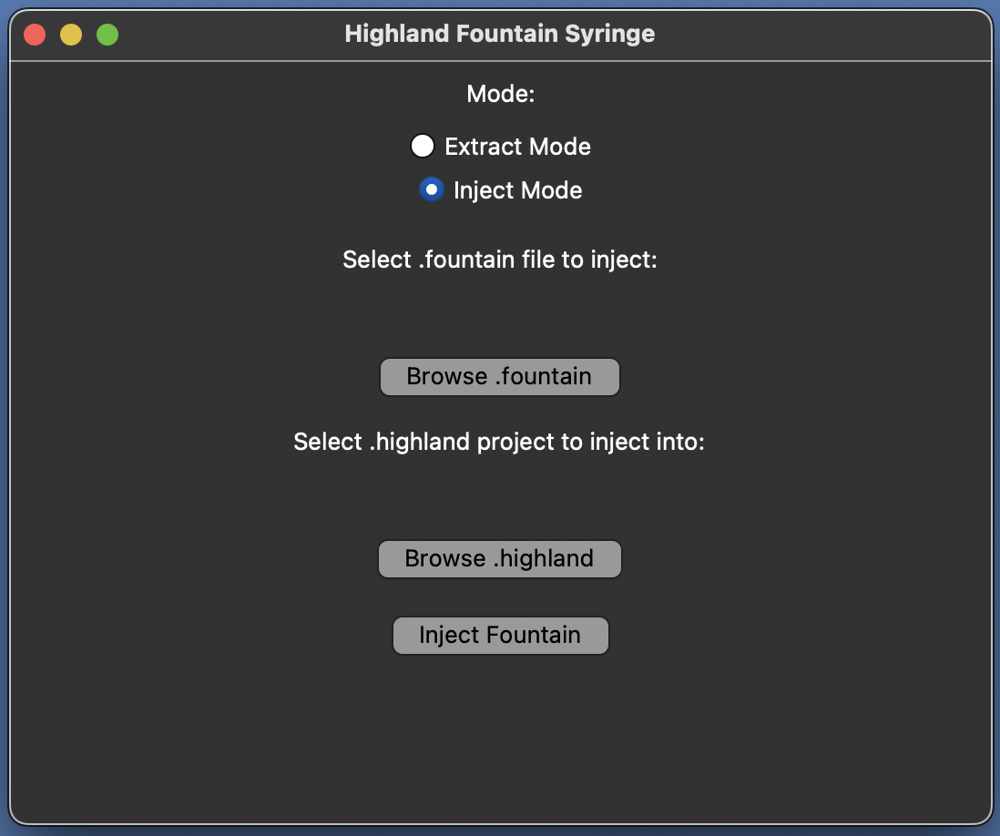

# Highland Fountain Syringe

A tool for extracting Fountain screenplay text and from Highland (_.highland_) project files, then reinjecting edits.

Pairs well with **[Better Fountain](https://github.com/piersdeseilligny/betterfountain)** (_.fountain_ support for VSCode).

---

## Features

- **Extract Mode**:
  Extracts the screenplay text (_.md_) from inside the _.textbundle_ in a Highland Pro (_.highland_) project file and saves it as a _.fountain_ file.

- **Inject Mode**:
  Injects the contents of a  _.fountain_ screenplay file into the _.md_ inside an existing _.highland_ project, preserving the internal structure and updating metadata (specifically, the contents of _revisions/current.json_) so the ensure the resulting file will open correctly in Highland Pro.

---

## Installation

1. Clone this repository:

    git clone https://github.com/davemh/highland-fountain-syringe.git
    cd highland-fountain-syringe

2. Install Python 3.10+ (if not already installed).

---

## Usage

Browse to the repo on your local machine and launch the GUI via command-line:

    python highland-fountain-syringe.py

### GUI

- **Extract Mode**:
  - Browse to select a _.highland_ file.
  - Click **Extract Fountain** to create a _.fountain_ file in the same folder.

- **Inject Mode**:
  - Browse to select a source _.fountain_ file containing a screenplay to inject.
  - Browse to select the _.highland_ project to inject into.
  - Click **Inject Fountain** to create a new _.highland_ file with _/_injected_ appended to the filename.

---

## Notes

- The _.highland_ project spec has changed over time! The initial release of this tool may not work with versions of Highland older than Highland Pro.
- This is a crossplatform tool -- it shoudl work on macOS, Windows, and Linux (given that Python 3.10+ is installed).

---

## Roadmap

- Add support for _.highland_ files created by Highland 2.
- Add support for _.highland_ files created by Highland (original release).
- Add automatic detection of Highland version based on _.highland_ file structure.
- Create and add binaries, so command line isn't needed to launch GUI.

---

## Contributing

Contributions are welcome! Particularly if you want to help add backward compatibility with _.highland_ files created by Highland and Highland 2.

- Fork the repo.
- Place any changes in a new branch called _feature/feature-name_.
- Submit a pull request.

Please include a clear explanation of changes (and screenshots if your change affects the GUI).

---

## License

Gnu GPL 3.0